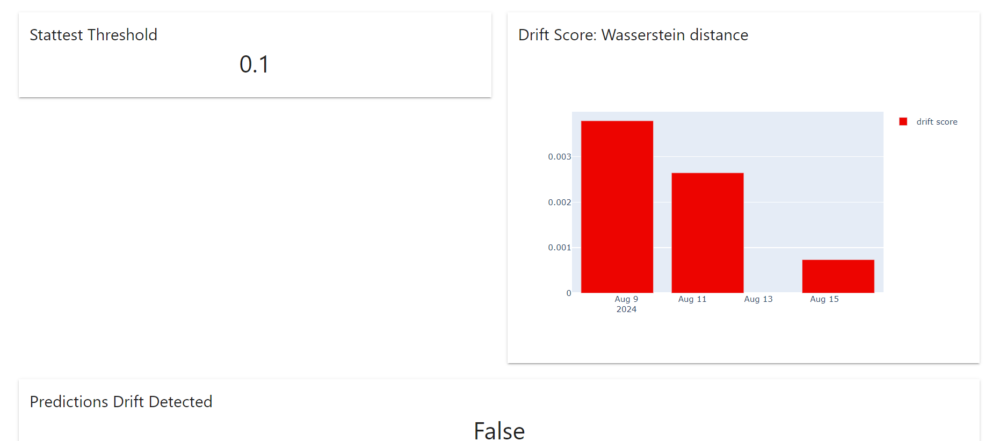

# MLOps Zoomcamp Cohort 2024

# Project: Predict Online Gaming Behavior

## Problem Description
### Business Context
The online gaming industry thrives on high player engagement, which directly correlates with increased revenue through in-game purchases, subscription fees, and sustained player base growth. Player engagement is a critical metric that impacts user retention, word-of-mouth promotion, and overall game popularity. Analyzing and predicting player engagement can help gaming companies develop strategies to enhance player experience, retain more players, and optimize revenue streams.

### Problem Statement
The **objective is to analyze the provided player data to predict the engagement level of the players**  ('High', 'Medium', 'Low'). Given features about the player and his gaming sessions' statistics, we'll try to forecast the engagement level of that player, the likelihood of continuing playing or leaving the platform. Using these predictions, the goal is to identify actionable insights and strategies to improve player engagement, thereby enhancing player retention and increasing revenue from in-game purchases and other monetization strategies.

**Return on Investment (ROI) and Benefits of higher Engagement**
* Increased Revenue: By enhancing player engagement, the company can boost in-game purchases and subscription renewals.
* Reduced Churn Rate: Improved engagement leads to higher retention, reducing the cost associated with acquiring new players.
* Customer Lifetime Value (CLV): Higher engagement generally increases the lifetime value of players, leading to long-term profitability.

### Approach Using Machine Learning

The next picture ilustrate the workflows or pipelines we have built using Mage AI to execute the relevant steps in a MLOps workflow to solve our problem:


- In our scenario, data about players and their playing behavior are collected every day.
- From the collected data, we can prepare and train an ML model to predict a player's engagement level.
- Then, each day in the evening, we run a batch inference process to obtain a prediction of each player's engagement level and this data is stored in a shared, presistent cloud storage.
- At the end of the week, we can compile the actual truth or target value based on the level of engagement the player has shown during the week. This means that we can have new training data.
- Every weekend, we can retrain our model and record a new version, a candidate model.
- Every Monday, we select the best model, compare the candidate model with the production model, establish the new best model and move it to production.
- Every night we run performance tests to check for problems related to data or model drift. If any of the relevant tests fail, we can force a retraining step.
- Some performance monitoring reports are also run every day. These are saved, and the ML team will have access to a dashboard and reports to keep up to date on model performance.


#### Data Understanding and Preprocessing
* Data Collection: Gather the dataset with fields about the gamers and their gaming behavior on the platform.
* Data Cleaning: Handle missing values, remove duplicates, and correct any inconsistencies in the data.
* Feature Engineering: Create or remove  features if necessary.
* Encode categorical variables (e.g., Gender, Location, GameGenre, EngagementLevel) using techniques like one-hot encoding or label encoding.
* Data Splitting: Divide the data into training, validation, and test sets to evaluate the model's performance.

#### Model Selection and Training
* Algorithm Choice: Consider various machine learning algorithms such as:
	- Logistic Regression: For baseline performance and interpretability.
	- Random Forest: For handling complex interactions and providing feature importance.
	- Gradient Boosting Machines (GBM): For high accuracy and robustness.
	- Neural Networks: If the data is sufficiently large and complex.

* Model Training: Train multiple models and perform hyperparameter tuning using techniques like cross-validation to optimize model performance.
* Feature Importance Analysis: Identify which features are most influential in predicting player engagement.

**Important**: We will not focus in the machine learning model and how to get the better approach. Therefore, **we will simplify tasks such as feature engineering, model selection, and hyperparameter tuning**. This project is about MLOps, and we will try to provide a solution to orchestrate the several pipelines this kind of problem requires. Consecuently, **we will not create any new feature**, **we have already chosen the model Gradient Booster** and we will not perform a hyperparameter tuning job, **we have selected some standard parameters**.

#### Model Evaluation
* Metrics:
	- Accuracy: Overall correctness of the model.
	- Precision, Recall, and F1-Score: For evaluating the balance between precision and recall, especially for the 'High' engagement category.
	- Confusion Matrix: To understand the types of errors the model is making.

#### Deployment and Monitoring
* Model Deployment: Deploy the best-performing model into the production environment.
* Continuous Monitoring: Track model performance over time to ensure it remains accurate and relevant, retraining as necessary.

### Business Objective and Optimization

Strategies to Improve Player Engagement
* In-Game Purchases: Recommend items or upgrades that align with the player's gaming behavior and preferences.
* Engagement Level-Based Campaigns: Create specific campaigns for 'Medium' and 'Low' engagement players to re-engage them with tailored offers, rewards, and incentives.
* Retention Programs: Design loyalty programs for 'High' engagement players to maintain their interest and reward their loyalty.
* In-Game Events and Achievements: Organize special in-game events and introduce new achievements to keep the game fresh and engaging.

## Dataset: Predict Online Gaming Behavior Dataset

This dataset is available on Kaggle website: https://www.kaggle.com/datasets/rabieelkharoua/predict-online-gaming-behavior-dataset/data.


#### Overview:
This dataset captures comprehensive metrics and demographics related to player behavior in online gaming environments. It includes variables such as player demographics, game-specific details, engagement metrics, and a target variable reflecting player retention.

**Features**:
- PlayerID: Unique identifier for each player.
- Age: Age of the player.
- Gender: Gender of the player.
- Location: Geographic location of the player.
- GameGenre: Genre of the game the player is engaged in.
- PlayTimeHours: Average hours spent playing per session.
- InGamePurchases: Indicates whether the player makes in-game purchases (0 = No, 1 = Yes).
- GameDifficulty: Difficulty level of the game.
- SessionsPerWeek: Number of gaming sessions per week.
- AvgSessionDurationMinutes: Average duration of each gaming session in minutes.
- PlayerLevel: Current level of the player in the game.
- AchievementsUnlocked: Number of achievements unlocked by the player.

**Target Variable:**
- EngagementLevel: Indicates the level of player engagement categorized as 'High', 'Medium', or 'Low'.

**Potential Applications**:
* Predictive modeling of player retention and engagement patterns.
* Analysis of factors influencing player behavior and game performance.
* Optimization of game design, marketing strategies, and player experience enhancements.

**Usage**:
This dataset is suitable for exploring patterns in online gaming behavior, developing machine learning models for player engagement prediction, and conducting research in gaming analytics.

## Experiment tracking and Model Registry


Mlflow is the platform of choice to track our training and evaluation stages. We will train a well-known scikit learn model and use Mlflow's Autolog feature to collect all relevant metrics during training. But we will also record evaluation metrics from the test data set.

Once our model is trained, we will log it (automatic logging is enabled) and it will be labeled as a candidate model. We have also built a pipeline to search for the best model and if the new model performs better than the current model, it will become the new production model and will be loaded for future predictions.

An mlflow server is deployed to track experiments and models, using S3 as a remote storage location. This is a very convenient way to share the model and artifacts with future instances of model deployment


You can read a full description and see the pipeline [HERE](docs/training_workflow.md)

## Workflow and Pipeline descriptions

### Workflow Orchestrator


We rely on Mage AI as our pipeline orchestrator, building a pipeline for each flow and a trigger to run the pipeline when it is required. Mage.ai, an open-source data engineering tool, combines the features of a Python library with workflow automation capabilities. It enables data professionals to utilize Python for a wide range of tasks, streamlining processes from data preparation to analysis and deployment.


### Data preparation stage:
---


	- Download and read the available training CSV data file from a AWS S3 folder
	- Clean and transform the data
	- Upload and save the processed dataset into an AWS S3 folder
    - Upload and save the players features into an AWS S3 folder


Detailed information and pipeline diagram [HERE](docs/data_preparation.md)

### Training stage:
---


	- Download and read the processed CSV dataset from a AWS S3 folder
	- Split the dataset into a train and test set
	- Set the model parameters in a configuration dict
	- Build a Scikit learn pipeline containing:
		- Transformer to scale the numerical features
		- Transformer to encode the categorical features
		- Create a Gradient Boosting Classifier with a predefined set of hyperparameters
	- Train or fit the pipeline and model to learn the parameters:
		- Keep track of the experiment, loging the metrics for training and testing using Mlflow
		- Register the model as a candidate model in the Mlflow server
	- Upload and save the train and test set as our reference dataset for performance monitoring


Detailed information and pipeline diagram  [HERE](docs/training_workflow.md)

### Best model selection stage:
---


	- Search for the model, the one with the highest value of our selected metric
	- Promote the best model as the production model, setting the alias. This one will be loaded for inference.
	- Load the best model an save it in a Global Data Product component in Mage

Detailed information and pipeline diagram [HERE](docs/model_selection.md)

### Batch inference:
---

	- Download and read the processed CSV dataset from a AWS S3 folder
	- Prepare the dataset, apply the same transformation that we execute in the training stage.
	- Load the model from the Global Data Product
	- Make predictions on the dataset
	- Upload and save predictions to the destination folder in S3
	- Upload and save the input data to the monitoring folder in S3. It will become the current data for performance monitoring.

Detailed information and pipeline diagram [HERE](docs/batch_inference.md)

### Online inference:
---

	- Load the model from the Global Data Product
	- Make a prediction for a list of inputs via Trigger API.

Detailed information and pipeline diagram [HERE](docs/online_inference.md)

### ML Retraining:
---
	This pipeline is triggered by code from the performance monitoring pipeline to retraining the model. IT simply triggers the Training pipeline.

	- Just one block to trigger the Training pipeline

### Performance Monitoring:
---

	- Load the reference and current data from an S3 folder
	- Run a Data Drift Test suite to check if any relevant column  has drifted.
	- Run a Prediction Drift Test suite to check if the prediction column  has drifted.
	- If the share of drifted columns is higher than 0.3 or prediction is drifted or AvgSessionDurationMinutes is drifted or SessionsPerWeek is drifted, then a retraining activated

Detailed information and pipeline diagram [HERE](docs/performance_monitoring.md)

### Performance Reports:
---

	- Load the reference and current data from an S3 folder
	- Prepare reference data for monitoring, removing the target column that is not present in the current data
	- Run a Summary Data Quality report, a Data Drift report and a Prediction Drift report
	- Upload and save the reports to an S3 folder. The Evidently UI will read and visualize them.

Detailed information and pipeline diagram [HERE](docs/performance_reports.md)

## Model Deployment

As we've mentioned in a previous section, we deploy our model on the Mage platform for both scenarios:

* Batch Inference: the preferred method. We want to predict the player's engagement level every day, then, business analyst will take actions based on this predicted behavior. More [info](docs/batch_inference.md) about this pipeline or process.

* Online Inference: A pipeline triggered via API. We also provide a POST API method to invoke the predictions for a list of inputs. More [info](docs/online_inference.md) about this pipeline.


## Model Monitoring


Evidently AI helps run ML in production reliably. Evidently gives visibility into how ML models behave in the wild and helps detect and debug issues, from data drift to segments of low performance. All with an open-source approach: extensible, open, and built together with the community.

For this project we use Evidently AI and have considered two actions in the surveillance strategy:

* **Performance Monitoring**: We run some tests on the current data (against benchmark or reference data), check the failure tests and retrain the model if any of the predefined conditions fail. You can read about these conditions and review the pipeline [here](docs/performance_monitoring.md)

* **Performance Reports**: Every day we collect data and then run some performance reports to visualize the evolution of some relevant metrics. The reports to run: Data Quality, Data Drift and Prediction Drift. More information and the pipeline [here](docs/performance_reports.md)

And **you can navigate to our Evidently UI** (This URL depends on how the solutions is deployed, you can read it later in the Instalation guide) and visualize a main **Dashboard** where you can easily assess data quality and performance. You can also navigate to individual **reports** to drill down to detailed information such as columns drifted, correlations, etc.



## Cloud

 						

This MLOps Workflows and solution can be deployed to Amazon Web Services using Terraform. Terraform is an Infraestructure-as-Code tool, used primarily by DevOps teams to automate various infrastructure tasks. The provisioning of cloud resources is one of the main use cases of Terraform. It’s a cloud-agnostic, open-source provisioning tool written in the Go language and created by HashiCorp.

The production solution includes the following architecture:


* Amazon ECS: Fargate containers distributed across 2 services:

- Mage, the Workflow Orchestrator: runing in a 4096 CPU and 8192 GB container and connected to an Amazon RDS Postgres database. And accesing to several S3 folder containing the CSV dataset and the transformed version depending on the stage.

- Mlflow, the experiment tracker and model registry tool: A Fargate service runing a Mlflow container, small size 1024 CPU and 2048 GB. Data is stored in a local SQLite to reduce cost and complexity and the artifacts are stored in a folder in an S3 bucket.

- Evidently UI: A new task and Fargate service, runing in 1024 CPU and 2048 GB Mem. It collects reports from an S3 folder and generate the reports and dashboard when started.

* Amazon ECR including three repositories for our images.
* Amazon Load Balancer: An application balancer to direct traffic to one of three containers.

* Amazon VPC: All components are protected inside a VPC to control access and networking.
	-	Several subnets and security groups to keep the solution secure.

## Best practices

### Unit testing

**Important**: Follow the instructions in the Installation and How-to guides before runing this setion.

We have include some unit test to show how to fit them into this kind of project. These unit tests check functions that are invoked from the Magew blocks to transform and prepare Pandas dataframe. Once we have created a DEV enviroment, you can install pytest (instruction are included in the following section) and run the test to check if things are working fine:

```bash
pytest tests/unit_tests.py
```

To make things easier, you can also run the command `make unit-tests` to run the unit tests.

```bash
make unit-tests
```

[Link](docs/testing.md) to the description and steps to run unit tests.

### Integration test

**Important**: Follow the instructions in the Installation and How-to guides before runing this setion.

**Integration testing** is a type of software testing where components of the software are gradually integrated and then tested as a whole. Usually, these components are already working well individually. However, they may break when integrated with other components.

For this project, we have prepared a test scenario where we run the mlflow server container and test the code in `machine_learning/utils' that creates a mlclient and connects to the container.

* Set some evironment variables
* Start the mlflow Docker container
* Run the integration tests
* Show the error output and logs.

Now, run the `make` command (set up env variables before):
```bash
make integration-tests
```
[Link](docs/testing.md) to the description and steps to run integration tests.

### Linting and Code Formatting
You can read a complete description of this step in the next [doc](docs/linting.md).

We apply some tools to check for quality code, standard formatting and programming best practices.
* isort
* black
* pylint

And create a `pyproject.toml` file to set up how to apply every tool.

We have added a Makefiel entry to run the quality checks and show possible errors:
```bash
make quality-checks
```
As a result, our code pass all quality tests.

### Makefile

A `Makefile` has been defined to facilitate the execution of some scripts such as:
- quality-checks: To run `isort`, `black` and `pylint`
- unit-tests: To run the unit tests
- run-dev-env: To launch the containers in development mode.
- run-report-server: To run the evidently report server.

There are some others, this way simplifies how to work with this project.

### Pre-commit hook
We include a pre-commit hook to make sure our code files are formatted and the unit tests are passed before commiting.
```bash
git commit -m "Adding pre commit config"
[WARNING] Unstaged files detected.
[INFO] Stashing unstaged files to /home/codespace/.cache/pre-commit/patch1723829155-50738.
Trim Trailing Whitespace.................................................Passed
Check Yaml...............................................................Passed
Check for added large files..............................................Passed
isort (python).......................................(no files to check)Skipped
black................................................(no files to check)Skipped
pylint...............................................(no files to check)Skipped
pytest-check.............................................................Passed
[INFO] Restored changes from /home/codespace/.cache/pre-commit/patch1723829155-50738.
[main b08c44f] Adding pre commit config
 2 files changed, 65 insertions(+)
 create mode 100644 .pre-commit-config.yaml
```


You can view the pre-commit configuration and results in this [section](docs/precommit.md)

## Reproducibility: Instructions on how to run the solution

There two scenarios to run the project:
* Deploy the dev solution: This DEV deployment consis of:
	- Mage Docker container running in port 6789
	- Postgres db container used by Mage in port 5432
	- Mlflow container running in port 5000 using a local SQLite database. The artifacts store is located in AWS S3.
	- Report server, an container running Evidently AI UI in port 8001.
	- A AWS S3 bucket containing several folder to store the input data and preprocessed data, the location to save the data for batch inference and its output, the datasets (current and reference) for monitoring performance and the reports.

	**It is the simplest way to simulate the project and only requires a S3 bucket, no more charges.**

* Deploy the prod solution: The PROD solutions deploys several AWS tools:
	- ECS Cluster
	- ECS Fargate services or containers for:
		- Mage
		- MlFlow
		- Report Server
	- ECR repositories to registry the docker images
	- Postgres RDS as database for Mage
	- Load balancer
	- VPC
	- etcetera

 **Important**: This deployment can incur relatively high costs, so we recommend using it for as long as necessary and then executing the removal of all deployed resources.

 ### **A how-to guide to prepare the environment and deploy both solutions are explained [HERE](docs/installation.md)**

## Contributing
If you find some bug or typo, please let me know.

## License

Copyright 2024 Eduardo Muñoz

   Licensed under the Apache License, Version 2.0 (the "License");
   you may not use this file except in compliance with the License.
   You may obtain a copy of the License at

       http://www.apache.org/licenses/LICENSE-2.0

   Unless required by applicable law or agreed to in writing, software
   distributed under the License is distributed on an "AS IS" BASIS,
   WITHOUT WARRANTIES OR CONDITIONS OF ANY KIND, either express or implied.
   See the License for the specific language governing permissions and
   limitations under the License.


