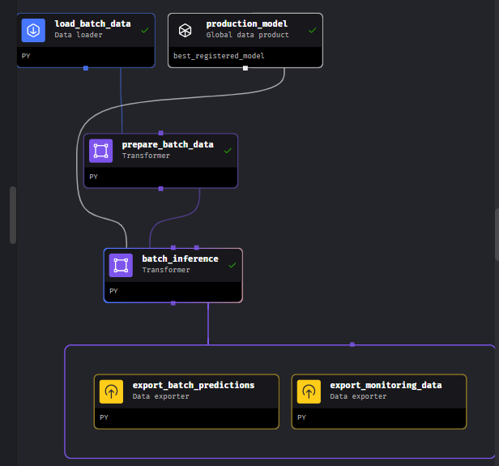

# MLOps Zoomcamp Cohort 2024
# Project: Predict Online Gaming Behavior

## Predict Online Gaming Behavior
## Problem Description
### Business Context
The online gaming industry thrives on high player engagement, which directly correlates with increased revenue through in-game purchases, subscription fees, and sustained player base growth. Player engagement is a critical metric that impacts user retention, word-of-mouth promotion, and overall game popularity. Analyzing and predicting player engagement can help gaming companies develop strategies to enhance player experience, retain more players, and optimize revenue streams.

### Problem Statement
The objective is to analyze the provided player data to predict the engagement level of the players  ('High', 'Medium', 'Low'). Given features about the player and his gaming sessions' statistics, we'll try to forecast the engagement level of that player, the likelihood of continuing playing or leaving the platform. Using these predictions, the goal is to identify actionable insights and strategies to improve player engagement, thereby enhancing player retention and increasing revenue from in-game purchases and other monetization strategies.

- In our scenario, data about about the players and their gaming behavior is collected every day. 
- Then, dayly at night, we run a batch inference process to get a predicted Engagement Level for every player and this data is stored in a shared and presistent storage on the cloud. 
- At the end of the week, we can collect the ground truth or actual target value, based on the engagement level the player has shown during the week. This means we may have new training data.
- Every weekend, we can retrain our model and register a new version, a candidate model.
- Every monday, we select the best model, comparing candidate/s model vs production model and we set the new best model and promote it to production.
- We run performace tests every night to check issues about data or model drift. If any of the relevent tests fails then we can force a retraining stage.
- Some performance monitoring reports are also executed every day. They are saved, and the ML team will access to a dashboard and the reports to keep up to date of the model performance.

### Approach Using Machine Learning
#### Data Understanding and Preprocessing
* Data Collection: Gather the dataset with fields about the gamers and their gaming behavior on the platform.
* Data Cleaning: Handle missing values, remove duplicates, and correct any inconsistencies in the data.
* Feature Engineering: Create or remove  features if necessary.
* Encode categorical variables (e.g., Gender, Location, GameGenre, EngagementLevel) using techniques like one-hot encoding or label encoding.
* Data Splitting: Divide the data into training, validation, and test sets to evaluate the model's performance.

#### Model Selection and Training
* Algorithm Choice: Consider various machine learning algorithms such as:
	- Logistic Regression: For baseline performance and interpretability.
	- Random Forest: For handling complex interactions and providing feature importance.
	- Gradient Boosting Machines (GBM): For high accuracy and robustness.
	- Neural Networks: If the data is sufficiently large and complex.

* Model Training: Train multiple models and perform hyperparameter tuning using techniques like cross-validation to optimize model performance.
* Feature Importance Analysis: Identify which features are most influential in predicting player engagement.

**Important**: We will not focus in the machine learning model and how to get the better approach. Therefore, **we will simplify tasks such as feature engineering, model selection, and hyperparameter tuning**. This project is about MLOps, and we will try to provide a solution to orchestrate the several pipelines this kind of problem requires. Consecuently, **we will not create any new feature**, **we have already chosen the model Gradient Booster** and we will not perform a hyperparameter tuning job, **we have selected some standard parameters**.

#### Model Evaluation
* Metrics:
	- Accuracy: Overall correctness of the model.
	- Precision, Recall, and F1-Score: For evaluating the balance between precision and recall, especially for the 'High' engagement category.
	- Confusion Matrix: To understand the types of errors the model is making.

#### Deployment and Monitoring
* Model Deployment: Deploy the best-performing model into the production environment.
* Continuous Monitoring: Track model performance over time to ensure it remains accurate and relevant, retraining as necessary.

### Business Objective and Optimization

Strategies to Improve Player Engagement
* In-Game Purchases: Recommend items or upgrades that align with the player's gaming behavior and preferences.
* Engagement Level-Based Campaigns: Create specific campaigns for 'Medium' and 'Low' engagement players to re-engage them with tailored offers, rewards, and incentives.
* Retention Programs: Design loyalty programs for 'High' engagement players to maintain their interest and reward their loyalty.
* In-Game Events and Achievements: Organize special in-game events and introduce new achievements to keep the game fresh and engaging.

### Return on Investment (ROI)
* Increased Revenue: By enhancing player engagement, the company can boost in-game purchases and subscription renewals.
* Reduced Churn Rate: Improved engagement leads to higher retention, reducing the cost associated with acquiring new players.
* Customer Lifetime Value (CLV): Higher engagement generally increases the lifetime value of players, leading to long-term profitability.

## Dataset: Predict Online Gaming Behavior Dataset

This dataset is available on Kaggle website: https://www.kaggle.com/datasets/rabieelkharoua/predict-online-gaming-behavior-dataset/data.


#### Overview:
This dataset captures comprehensive metrics and demographics related to player behavior in online gaming environments. It includes variables such as player demographics, game-specific details, engagement metrics, and a target variable reflecting player retention.

**Features**:
- PlayerID: Unique identifier for each player.
- Age: Age of the player.
- Gender: Gender of the player.
- Location: Geographic location of the player.
- GameGenre: Genre of the game the player is engaged in.
- PlayTimeHours: Average hours spent playing per session.
- InGamePurchases: Indicates whether the player makes in-game purchases (0 = No, 1 = Yes).
- GameDifficulty: Difficulty level of the game.
- SessionsPerWeek: Number of gaming sessions per week.
- AvgSessionDurationMinutes: Average duration of each gaming session in minutes.
- PlayerLevel: Current level of the player in the game.
- AchievementsUnlocked: Number of achievements unlocked by the player.

Target Variable:
- EngagementLevel: Indicates the level of player engagement categorized as 'High', 'Medium', or 'Low'.

**Potential Applications**:
* Predictive modeling of player retention and engagement patterns.
* Analysis of factors influencing player behavior and game performance.
* Optimization of game design, marketing strategies, and player experience enhancements.

**Usage**:
This dataset is suitable for exploring patterns in online gaming behavior, developing machine learning models for player engagement prediction, and conducting research in gaming analytics.

## Experiment tracking and Model Registry

Mlflow is the chossen platform to keep track of our training and evaluation stages. We will train a well-known scikit learn model and we'll use the Autolog feature in Mlflow to collect all the relevent metrics during training. But we'll also register the metrics from the test dataset evaluation.

Once our model is trained, we will register the model (Automatic registering is activated) and it will be tagged as a candidate model. We also have built a pipeline to search for the best model and if the new model performs better that the actual model, it will become the new production model and will be loaded for future predictions.

An mlflow server is deployed to track experiments and models, using S3 as the remote storage location. It is a very convenient way to share the model and artifacts with future model deployment instances.

You can read more detaiuls and check the pipeline in this [link]

## Workflow and process description


### Workflow Orchestrator

We rely on Mage AI as our pipeline orchestrator, building a pipeline for each flow and a trigger to run the pipeline when it is required.

#### IMAGE PIPELINES

### Data preparation stage:  

Deteiled information [HERE](./data_preparation.md)

### Training stage:
Detailed information [HERE](./training_workflow.md)

### Best model selection stage:
Detailed information [HERE](./model_selection.md)

### Batch inference:


	- Download and read the processed CSV dataset from a AWS S3 folder
	- Prepare the dataset, apply the same transformation that we execute in the training stage.
	- Load the model from the Global Data Product
	- Make predictions on the dataset
	- Upload and save predictions to the destination folder in S3
	- Upload and save the input data to the monitoring folder in S3. It will become the current data for performance monitoring. 

### Online inference:


	- Load the model from the Global Data Product
	- Make a prediction for a list of inputs via Trigger API.

### ML Retraining:
	This pipeline is triggered by code from the performance monitoring pipeline to retraining the model.

	- Just one block to trigger the Training pipeline

### Performance Monitoring:


	- Load the reference and current data from an S3 folder
	- Run a Data Drift Test suite to check if any relevant column  has drifted.
	- Run a Prediction Drift Test suite to check if the prediction column  has drifted.
	- If the share of drifted columns is higher than 0.3 or prediction is drifted or AvgSessionDurationMinutes is drifted or SessionsPerWeek is drifted, then a retraining activated

### Performance Reports:


	- Load the reference and current data from an S3 folder
	- Prepare reference data for monitoring, removing the target column that is not present in the current data
	- Run a Summary Data Quality report, a Data Drift report and a Prediction Drift report
	- Upload and save the reports to an S3 folder. The Evidently UI will read and visualize them.

## Model Deployment

As we've mentioned in a previous section, we deploy our model on the Mage platform for both scenarios:
	- Batch Inference: the preferred method. More [info](#batch-inference)
	- Online Inference: a pipeline triggered via API. More [info](#online-inference)

## Model Monitoring

For this project, we have considered two actions in the surveillance strategy:
	- Performance Monitoring: run some test on the current data (vs reference data) and retrain a model if any of the defined conditions fails. More [info](#performance-monitoring)
	- Performance Reports: collect data and run some reports on performance to visualize the evolution of some relevant metrics. More [info](#performance-reports)

## Best practices

### Unit testing


## Prerequisites to run the project demo
1. Docker:
	You need to install docker for your OS. [Link to installation](https://docs.docker.com/engine/install/) 
2. Git
	You can install Git from this [link](https://git-scm.com/book/en/v2/Getting-Started-Installing-Git)
3. Terraform
	Installation: https://developer.hashicorp.com/terraform/install

**Note:** You can use a GitHub Codespace to run this demo, it's installed both Docker and Git. You can watch [this video](https://youtu.be/XOSUt8Ih3zA&list=PL3MmuxUbc_hJed7dXYoJw8DoCuVHhGEQb&index=15) for instructions on how to prepare a Codespace.

## Instruction to prepare your GCP for this demo
1. Create a GCP Project 
	Our example Project_id = 'gdelt-project-data'
2. Create a service account in the project, grant it the permissions:
	- Storage Admin
	- Bigquery Admin
	- Service Usage Admin
	- Service Management Administrator
    You can include more permissions if you want to expand this project for a future use.
3. Create an access key JSON file, you need to download its private key file. 
	- This key file will be used to authenticate requests to GCP services.
	- Select the service account you just created to view its details, Click on the "Keys" tab and then click the "Add Key" button.
	- Select the "JSON" key type and click "Create" to download the private key file. 
	  **Rename your json file to `gdelt-project-credentials.json` and copy it to the mage directory `mage-gdelt` and the terraform folder `terraform`**

## To run the demo project
1. Clone the repo to your local folder or to a VM or Github Codespace
```bash
git clone https://github.com/edumunozsala/GDELT-Events-Data-Eng-Project.git
```

2. Copy the json file with the GCP service account credentials to the folders `terraform` and `mage-gdelt` with the filename `gdelt-project-credentials.json`
3. Create the GCP objects with Terraform

**You can modify the file `variables.tf`, if you want to change the names of the GCP object to create for this demo. You will also need to modify the `.env`**

4.  `cd` into the terraform directory.
5. Initialize terraform folder

```bash
terraform init
```
6. To show changes to apply:

```bash
terraform plan
```
7. To create or update infrastructure:

```bash
terraform apply
```
**Our terraform script enable the BigQuery API**

8. `cd` into mage directory `mage-gdelt`
9. Rename the file `dev.env` to `.env` and review the parameters.

	**Values you can change: the buckets name and dataset you create with terraform
	but you must not change PROJECT_NAME, SPARK_MASTER_HOST, GOOGLE_APPLICATION_CREDENTIALS, ENV**
	
		Days to collect: you can change this value if you want to collect more or less data. Be carefull with the value you include.

10. Build the container
	`docker compose build`
11. Run the contaier
`docker compose up`
12. Open Mage UI in your web browser.
	If you are running it locally go to http://localhost:6789, but this link may differ depending on where and how you run the docker container.
13. To run the whole workflow you just need to open the `load_bronze_gcs` pipeline and click the run once button.


Click on run@nce:


Go to logs to watch how the process advance, when a pipeline finish the next one is automatically launch. Open every pipeline to see the logs.

**It takes about 15 minutes to download and move to Cloud Storage all the csv files, 4,700, and about 10 minutos to process them and create the dataframes and tables.**

14. Once the workflow has finished you can go to the dashboard on [Looker Studio](https://lookerstudio.google.com/reporting/f1018a56-01ea-422b-8c40-ea9b1a87ee01)

Some Visualizations:

**TOTAL EVENTS**


**IMPORTANT**: When you are done you can destroy the GCP bjects :

```bash
terraform destroy
```


