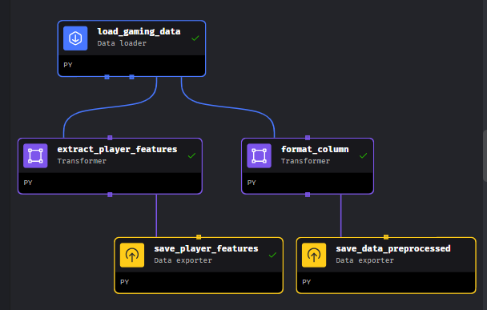

# MLOps Zoomcamp Cohort 2024
# Project: Predict Online Gaming Behavior

## Workflow Orchestrator

### Data preparation stage

This pipeline is responsible for preparing the dataset to be used as features to our training process. In our scenario, it is very simple and no complex transformations are requiered. We only apply business transformations in this stage, but the ones to adapt the column values to trainable features will be performed as part of the training process. 

We only need to run this pipeline on demand, when new data with all features, including the target variable, has been collected.

Flow diagram:

	- Download and read the available training CSV data file from a AWS S3 folder
	- Clean and transform the data
	- Upload and save the processed dataset into an AWS S3 folder
    - Upload and save the players features into an AWS S3 folder

