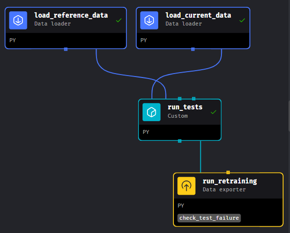

# MLOps Zoomcamp Cohort 2024
# Project: Predict Online Gaming Behavior

## Workflow Orchestrator

### Performance Monitoring stage

The monitoring strategy includes a daily check, every night. Using Evidently AI library, we execute the following Test Suites:
    - Data Drift
    - Prediction Drift

Once the Test have been executed, we run a retraining stage when one of the following conditions fails:
    - More than 30% of drifted columns
    - `AvgSessionDurationMinutes` is drifted
    - `SessionsPerWeek` is drifted

Both `AvgSessionDurationMinutes` and `SessionsPerWeek` are the most important or correlated features with respect to the target, so we want to keep them in the expected distribution.

Flow diagram:

	- Load the reference and current data from an S3 folder
	- Run a Data Drift Test suite to check if any relevant column  has drifted.
	- Run a Prediction Drift Test suite to check if the prediction column  has drifted.
	- If the share of drifted columns is higher than 0.3 or prediction is drifted or AvgSessionDurationMinutes is drifted or SessionsPerWeek is drifted, then a retraining is executed
