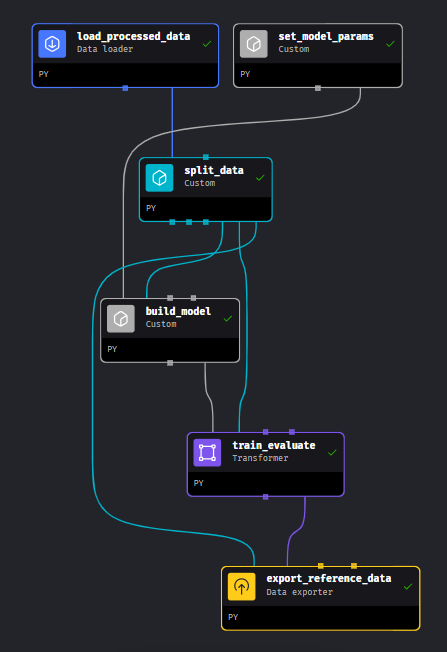

# MLOps Zoomcamp Cohort 2024
# Project: Predict Online Gaming Behavior

## Workflow Orchestrator

### Training stage

The training workflow will produce a new trained model on the training dataset and evaluate the performance on the test set. The building and optimization of the ML model is not the core of this project, so it is just a training job using a common model using sklearn.

We use Mlflow to keep track of model training and evaluation and to store the models.

We only run this pipeline on the training stage and when the monitoring job detect any performance  failure. When a data drift or prediction drift is detected, we run the retraining pipeline that basically calls to the training workflow.

Flow diagram:

	- Download and read the processed CSV dataset from a AWS S3 folder
	- Split the dataset into a train and test set
	- Set the model parameters in a configuration dict
	- Build a Scikit learn pipeline containing:
		- Transformer to scale the numerical features
		- Transformer to encode the categorical features
		- Create a Gradient Boosting Classifier with a predefined set of hyperparameters
	- Train or fit the pipeline and model to learn the parameters:
		- Keep track of the experiment, loging the metrics for training and testing using Mlflow
		- Register the model as a candidate model in the Mlflow server
	- Upload and save the train and test set as our reference dataset for performance monitoring

A screenshot of the Mlflow UI:

